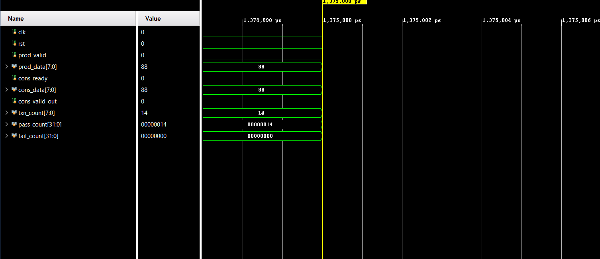

# SystemVerilog Valid-Ready Pipeline (1-Stage)

A verified implementation of a **1-stage valid-ready pipeline** in SystemVerilog, including a constrained-random, self-checking testbench.

The design demonstrates correct handling of:
- Flow control  
- Backpressure  
- Transaction ordering  

---

## Overview

This design models a **synchronous streaming interface**:

- `valid` → asserted by producer  
- `ready` → asserted by consumer  
- Data transfer occurs only when **both are high**

The DUT implements a single-stage pipeline register with:
- Backpressure support  
- No data loss  
- No data duplication  
- Deterministic transaction counting  

---

## Architecture


Producer ──(valid,data)──▶ [ Pipeline Stage ] ──▶ Consumer
◀──── ready ────────


---

## Repository Structure


sv-pipeline-valid-ready/
│
├── src/
│ └── pipeline_dut.sv
│
├── sim/
│ ├── tb_pipeline.sv
│ └── transaction.sv
│
├── waveform.png
├── .gitignore
└── README.md


---

## Verification Strategy

The testbench uses a **self-checking constrained-random approach**:

### Stimulus
- Random data values  
- Random inter-transaction delays  
- Random consumer backpressure  

### Checking
- Mailbox-based transaction tracking  
- Scoreboard comparison (expected vs actual)  
- Automatic pass/fail reporting  

---

## Simulation Results


SIMULATION COMPLETE
PASS : 20 / 20
FAIL : 0 / 20
DUT COUNT: 20


---

## Waveform



### Observations

- Correct valid-ready handshake  
- Data stability during backpressure  
- No data loss or duplication  
- `txn_count` increments only on valid transfers  

---

## How to Run

### Using Vivado XSim

```bash
xvlog src/pipeline_dut.sv sim/transaction.sv sim/tb_pipeline.sv
xelab tb_pipeline -s tb_pipeline_sim
xsim tb_pipeline_sim -run all
```

---

## Key Design Decisions

1. **Single-entry buffering**
   Ensures simple control and deterministic behavior

2. **Registered outputs**
   Avoids combinational hazards

3. **Handshake-driven counting**
   Transaction count updates only on:

   ```systemverilog
   valid && ready
   ```

4. **Backpressure-safe logic**
   Data is never overwritten unless consumed

---

## Possible Extensions

* Multi-stage pipeline (FIFO)
* AXI-Stream wrapper
* Functional coverage
* UVM-based verification

---

## Author

**Arya Dinesh**  
B.Tech Electronics & Communication Engineering
