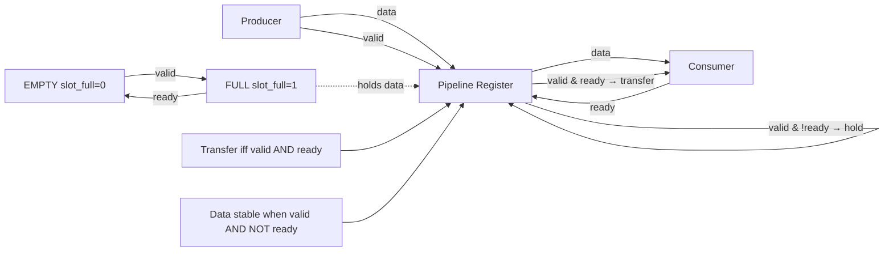

# 🚀 SystemVerilog Valid-Ready Pipeline Verification

<p align="center">
  
  
  
  
</p>

<p align="center">
  <b>Backpressure-aware, lossless 1-stage streaming pipeline</b><br>
  <sub>(Elastic Buffer / AXI-Stream Register Slice Equivalent)</sub>
</p>

---

## ⚡ Executive Summary

| Aspect     | Detail                                        |
| ---------- | --------------------------------------------- |
| Problem    | Reliable data transfer under backpressure     |
| Solution   | 1-stage valid-ready pipeline (elastic buffer) |
| Guarantee  | No data loss, no overwrite, in-order delivery |
| Latency    | 1 cycle                                       |
| Throughput | 1 txn / cycle (no stalls)                     |
| Result     | PASS 20 / 20                                  |

---

## 🧩 Problem Statement

In synchronous digital systems, **producer and consumer operate at independent rates**.
Without proper flow control:

* ❌ Data loss under backpressure
* ❌ Overwrite of unconsumed data
* ❌ Ordering violations
* ❌ Non-deterministic throughput

---

## 🎯 Objective

Design and verify a pipeline stage that:

* ✔ Guarantees **lossless transfer**
* ✔ Handles **arbitrary backpressure**
* ✔ Preserves **strict ordering**
* ✔ Ensures **cycle-accurate deterministic behavior**

---

## 🔗 Protocol Definition

A transaction occurs **iff**:

```systemverilog
valid && ready
```

---

## 🧠 Architecture



> Equivalent to a **1-depth elastic buffer / AXI-Stream register slice**

---

## 🏗️ Design Summary

| Component   | Role                         |
| ----------- | ---------------------------- |
| `data_reg`  | Holds current transaction    |
| `slot_full` | Indicates valid data present |
| `txn_count` | Counts completed transfers   |

### Behavior

| Condition     | Action            |
| ------------- | ----------------- |
| full + ready  | consume           |
| empty + valid | load              |
| full + !ready | stall (hold data) |

---

## 🧪 Verification Strategy

### Architecture

* Generator
* Driver
* Monitor
* Scoreboard (mailbox-based)

### Stimulus

* Random data
* Random delay (1–5 cycles)
* Random backpressure (0–8 cycles)

---

## 🧷 Assertions (SVA)

```systemverilog
// Transfer occurs only on handshake
property handshake_transfer;
  @(posedge clk) (valid && ready) |-> ##1 txn_count == $past(txn_count) + 1;
endproperty
assert property (handshake_transfer);

// Data must remain stable under backpressure
property data_stable_on_stall;
  @(posedge clk) (valid && !ready) |-> $stable(data_reg);
endproperty
assert property (data_stable_on_stall);

// No overwrite before consumption
property no_overwrite;
  @(posedge clk) (slot_full && !ready) |-> $stable(data_reg);
endproperty
assert property (no_overwrite);
```

---

## 📊 Functional Coverage

```systemverilog
covergroup handshake_cg @(posedge clk);
  coverpoint valid;
  coverpoint ready;
  cross valid, ready;
endgroup
```

---

## ⏱️ Timing Behavior

```
Clock      ─┐_┌─┐_┌─┐_┌─┐_┌─┐_┌─┐_┌─┐_┌─┐

valid      ──■■■■■■■■────■■■■■■■■────────
ready      ─────■■■■■■■■──────■■■■■■────
data       === A === B === B === C === D ===

handshake     ↑     ↑        ↑     ↑
              A     B        C     D

txn_count     0 → 1 → 2 → 2 → 3 → 4
```

### Interpretation

* ✔ Transfer only when `valid && ready`
* ✔ Data stable during stall
* ✔ No overwrite
* ✔ Count increments only on handshake

---

## 📈 Waveform Evidence

<p align="center">
  
</p>

✔ Handshake correctness
✔ Backpressure handling
✔ Stable data
✔ In-order execution

---

## 📌 Verification Results

| Metric         | Status   |
| -------------- | -------- |
| Transactions   | 20       |
| PASS           | 20       |
| FAIL           | 0        |
| Assertions     | PASS     |
| Data Integrity | Verified |

---

## ⚙️ Performance

| Metric       | Value       |
| ------------ | ----------- |
| Latency      | 1 cycle     |
| Throughput   | 1 txn/cycle |
| Backpressure | Lossless    |

---

## ▶️ How to Run

```bash
xvlog src/pipeline_dut.sv sim/transaction.sv sim/tb_pipeline.sv
xelab tb_pipeline -s tb_pipeline_sim
xsim tb_pipeline_sim -run all
```

---

## 📁 Repository Structure

```
src/
 └── pipeline_dut.sv

sim/
 ├── tb_pipeline.sv
 └── transaction.sv

waveform.png
README.md
.gitignore
```

---

## 🏭 Industry Relevance

* AXI-Stream pipelines
* Network-on-Chip routers
* DSP streaming systems
* FIFO front-end buffering

---

## 🔮 Extensions

* Multi-stage FIFO
* Skid buffer design
* AXI-Stream wrapper
* UVM verification environment
* Coverage closure metrics

---

## 🧠 Design Invariants

```text
1. Transfer ⇔ valid && ready
2. Data stable when valid && !ready
3. No overwrite before consumption
4. txn_count increments only on handshake
```

---

## 👤 Author

**Arya Dinesh**  
*B.Tech Electronics & Communication Engineering*

📫 *Let’s connect:* www.linkedin.com/in/aryadinesh2005 

---

⭐ *If you found this project interesting, feel free to star this repository!*  
🧠 *Open for collaboration or discussion on FPGA, digital design, and embedded systems.*

---

